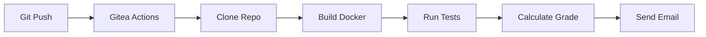

# Workflow de Correction Automatique

Ce guide explique en détail le processus de correction automatique de vos projets Docker.

## 📊 Vue d'Ensemble

Le système de correction automatique utilise **Gitea Actions** pour évaluer vos projets dès que vous faites un `git push`.



## 🔄 Étapes du Workflow

### 1. Déclenchement Automatique

Le workflow se déclenche automatiquement sur :
- ✅ Push sur la branche `main` ou `master`
- ✅ Pull Request vers `main`

Fichier `.gitea/workflows/correction.yml` :

```yaml
name: Correction Automatique

on:
  push:
    branches:
      - main
      - master
  pull_request:
    branches:
      - main

jobs:
  correction:
    runs-on: ubuntu-latest
    steps:
      - name: Checkout code
        uses: actions/checkout@v3

      - name: Build Docker images
        run: docker compose build

      - name: Run tests
        run: docker compose up -d && sleep 5

      - name: Evaluate
        run: ./scripts/evaluate.sh
```

### 2. Clonage du Repository

Le runner clone votre repository :

```bash
git clone https://git.zohrabi.cloud/Groupe-A/jean.dupont-tds.git
cd jean.dupont-tds
```

### 3. Build Docker

Le système tente de builder vos images :

```bash
docker compose build --no-cache
```

**Critères évalués** :
- ✅ Build réussi sans erreur (20 points)
- ✅ Temps de build < 5 minutes (5 points)
- ✅ Taille image < 500MB (5 points)
- ✅ Multi-stage build utilisé (bonus +5 points)

### 4. Démarrage des Services

Les services sont lancés :

```bash
docker compose up -d
sleep 10  # Attendre que les services démarrent
```

**Critères évalués** :
- ✅ Tous les services démarrent (15 points)
- ✅ Services en état "healthy" (10 points)
- ✅ Pas de crash au démarrage (5 points)

### 5. Tests Fonctionnels

Le système exécute une série de tests :

#### Test de Connectivité
```bash
# Test HTTP
curl -f http://localhost:80 || exit 1

# Test healthcheck
curl -f http://localhost:80/health || exit 1
```

#### Test des Logs
```bash
# Vérifier qu'il n'y a pas d'erreurs critiques
docker compose logs | grep -i "error" && exit 1
```

#### Test de Persistance (si applicable)
```bash
# Redémarrer et vérifier que les données persistent
docker compose restart
sleep 5
curl -f http://localhost:80 || exit 1
```

**Critères évalués** :
- ✅ Réponse HTTP 200 (10 points)
- ✅ Healthcheck fonctionnel (5 points)
- ✅ Logs propres (5 points)
- ✅ Persistance données (10 points)

### 6. Analyse de Qualité

Vérification des bonnes pratiques :

#### Dockerfile
- ✅ Image de base officielle (5 points)
- ✅ Version spécifiée (pas `latest`) (5 points)
- ✅ Multi-stage build (5 points)
- ✅ USER non-root (3 points)
- ✅ Labels informatifs (2 points)

#### docker-compose.yml
- ✅ Version spécifiée (2 points)
- ✅ Networks définis (3 points)
- ✅ Restart policy (2 points)
- ✅ Healthchecks (3 points)

#### Documentation
- ✅ README.md présent (5 points)
- ✅ README complet (5 points)
- ✅ Comments dans le code (3 points)

### 7. Calcul de la Note

```
Note Finale = Build (30) + Démarrage (30) + Tests (30) + Qualité (20) + Bonus
Maximum: 100 points + Bonus
```

### 8. Génération du Rapport

Le système génère un rapport HTML détaillé :

```html
<!DOCTYPE html>
<html>
<head>
    <title>Rapport de Correction</title>
</head>
<body>
    <h1>Résultat de Correction</h1>

    <div class="score">
        <h2>Note: 85/100</h2>
    </div>

    <div class="details">
        <h3>Build Docker (30/30)</h3>
        <ul>
            <li>✅ Build réussi: 20/20</li>
            <li>✅ Temps optimal: 5/5</li>
            <li>✅ Taille correcte: 5/5</li>
        </ul>

        <h3>Démarrage (25/30)</h3>
        <ul>
            <li>✅ Services démarrés: 15/15</li>
            <li>⚠️ Healthcheck partiel: 5/10</li>
            <li>✅ Pas de crash: 5/5</li>
        </ul>

        <!-- ... -->
    </div>
</body>
</html>
```

### 9. Envoi de l'Email

Un email est envoyé à votre adresse Gitea :

**Sujet** : `✅ Correction TD1 - Note: 85/100`

**Contenu** :
- 📊 Votre note
- 📋 Rapport HTML complet
- 💡 Suggestions d'amélioration
- 🔗 Lien vers les logs

## 📈 Barème Détaillé

### Build Docker (30 points)
| Critère | Points |
|---------|--------|
| Build réussi | 20 |
| Temps < 5min | 5 |
| Taille < 500MB | 5 |

### Démarrage (30 points)
| Critère | Points |
|---------|--------|
| Services démarrent | 15 |
| Healthchecks OK | 10 |
| Pas de crash | 5 |

### Tests Fonctionnels (30 points)
| Critère | Points |
|---------|--------|
| HTTP 200 | 10 |
| Healthcheck endpoint | 5 |
| Logs propres | 5 |
| Persistance | 10 |

### Qualité Code (20 points)
| Critère | Points |
|---------|--------|
| Dockerfile best practices | 10 |
| docker-compose.yml qualité | 5 |
| Documentation README | 5 |

### Bonus (jusqu'à +10)
| Bonus | Points |
|-------|--------|
| Multi-stage build | +5 |
| Security scan passed | +3 |
| Tests unitaires | +2 |

## 🔍 Comprendre les Logs

### Accéder aux Logs du Workflow

1. Allez sur Gitea
2. Ouvrez votre repository
3. Cliquez sur **"Actions"**
4. Sélectionnez le workflow en cours ou terminé

### Types de Logs

#### Logs de Build
```
Step 1/5 : FROM nginx:alpine
 ---> abc123def456
Step 2/5 : COPY app/ /usr/share/nginx/html/
 ---> Using cache
 ---> def456ghi789
...
Successfully built def456ghi789
```

#### Logs de Tests
```
[TEST] HTTP Connectivity...
✅ PASS: HTTP 200 received
[TEST] Healthcheck...
✅ PASS: /health endpoint responds
[TEST] Logs check...
✅ PASS: No critical errors found
```

#### Logs d'Erreur
```
❌ ERROR: Build failed
Error response from daemon: dockerfile parse error line 3:
Unknown instruction: EXPOSE80 (should be EXPOSE 80)
```

## 🛠️ Débugger les Problèmes

### Build qui Échoue

**Problème** : `docker compose build` échoue

**Solutions** :
1. Tester localement :
   ```bash
   docker compose build
   ```
2. Vérifier la syntaxe du Dockerfile
3. Vérifier que toutes les dépendances existent

### Services qui ne Démarrent Pas

**Problème** : Les conteneurs crashent au démarrage

**Solutions** :
1. Vérifier les logs localement :
   ```bash
   docker compose up
   docker compose logs
   ```
2. Vérifier les ports (pas de conflit)
3. Vérifier les variables d'environnement

### Tests qui Échouent

**Problème** : Note faible malgré un build réussi

**Solutions** :
1. Tester les endpoints manuellement :
   ```bash
   curl http://localhost:80
   curl http://localhost:80/health
   ```
2. Vérifier les logs d'application
3. S'assurer que les services sont prêts avant les tests

## 💡 Conseils pour Améliorer sa Note

### ✅ Avant de Push

1. **Tester localement** :
   ```bash
   docker compose build
   docker compose up -d
   docker compose ps
   docker compose logs
   curl http://localhost
   docker compose down
   ```

2. **Vérifier le Dockerfile** :
   - Image officielle avec version
   - Multi-stage build si possible
   - USER non-root
   - Labels ajoutés

3. **Vérifier docker-compose.yml** :
   - Networks définis
   - Restart policy
   - Healthchecks
   - Pas de ports inutiles exposés

4. **Documenter** :
   - README.md complet
   - Comments dans les fichiers complexes

### ✅ Après le Push

1. **Suivre le Workflow** :
   - Onglet Actions sur Gitea
   - Vérifier que tout est vert

2. **Lire le Rapport** :
   - Email avec rapport détaillé
   - Identifier les points perdus
   - Appliquer les suggestions

3. **Itérer** :
   - Corriger les erreurs
   - Push à nouveau
   - Améliorer progressivement

## 📧 Format de l'Email de Correction

```
De: correction@zohrabi.cloud
À: jean.dupont@example.com
Sujet: ✅ Correction TD1 - Note: 85/100

Bonjour Jean Dupont,

Votre projet TD1 a été corrigé automatiquement.

📊 Note Finale: 85/100

🎯 Détails:
- Build Docker: 30/30 ✅
- Démarrage: 25/30 ⚠️
- Tests Fonctionnels: 25/30 ⚠️
- Qualité Code: 15/20 ⚠️

💡 Suggestions d'Amélioration:
- Ajouter un healthcheck dans docker-compose.yml
- Documenter davantage le README.md
- Utiliser multi-stage build pour réduire la taille

📋 Rapport complet en pièce jointe (HTML)

🔗 Logs: https://git.zohrabi.cloud/Groupe-A/jean.dupont-tds/actions

Bon courage!
```

## 🆘 Support

- 📖 Consultez la [FAQ](/page/faq)
- 💡 Voir les [Exemples](/page/project-examples)
- 📧 Contactez : **Reza@zohrabi.fr**

---

**Bonne chance pour vos projets ! 🚀**