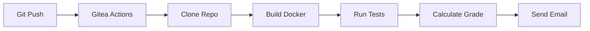

# Automated Correction Workflow

This guide explains in detail the automated correction process for your Docker projects.

## 📊 Overview

The automated correction system uses **Gitea Actions** to evaluate your projects as soon as you do a `git push`.



## 🔄 Workflow Steps

### 1. Automatic Triggering

The workflow is automatically triggered on:
- ✅ Push to the `main` or `master` branch
- ✅ Pull Request to `main`

File `.gitea/workflows/correction.yml`:

```yaml
name: Automated Correction

on:
  push:
    branches:
      - main
      - master
  pull_request:
    branches:
      - main

jobs:
  correction:
    runs-on: ubuntu-latest
    steps:
      - name: Checkout code
        uses: actions/checkout@v3

      - name: Build Docker images
        run: docker compose build

      - name: Run tests
        run: docker compose up -d && sleep 5

      - name: Evaluate
        run: ./scripts/evaluate.sh
```

### 2. Repository Cloning

The runner clones your repository:

```bash
git clone https://git.zohrabi.cloud/Groupe-A/jean.dupont-tds.git
cd jean.dupont-tds
```

### 3. Docker Build

The system attempts to build your images:

```bash
docker compose build --no-cache
```

**Evaluated criteria**:
- ✅ Successful build without errors (20 points)
- ✅ Build time < 5 minutes (5 points)
- ✅ Image size < 500MB (5 points)
- ✅ Multi-stage build used (bonus +5 points)

### 4. Service Startup

Services are launched:

```bash
docker compose up -d
sleep 10  # Wait for services to start
```

**Evaluated criteria**:
- ✅ All services start (15 points)
- ✅ Services in "healthy" state (10 points)
- ✅ No crash on startup (5 points)

### 5. Functional Tests

The system executes a series of tests:

#### Connectivity Test
```bash
# HTTP Test
curl -f http://localhost:80 || exit 1

# Healthcheck test
curl -f http://localhost:80/health || exit 1
```

#### Logs Test
```bash
# Check for no critical errors
docker compose logs | grep -i "error" && exit 1
```

#### Persistence Test (if applicable)
```bash
# Restart and verify data persists
docker compose restart
sleep 5
curl -f http://localhost:80 || exit 1
```

**Evaluated criteria**:
- ✅ HTTP 200 response (10 points)
- ✅ Functional healthcheck (5 points)
- ✅ Clean logs (5 points)
- ✅ Data persistence (10 points)

### 6. Quality Analysis

Verification of best practices:

#### Dockerfile
- ✅ Official base image (5 points)
- ✅ Version specified (not `latest`) (5 points)
- ✅ Multi-stage build (5 points)
- ✅ Non-root USER (3 points)
- ✅ Informative labels (2 points)

#### docker-compose.yml
- ✅ Version specified (2 points)
- ✅ Networks defined (3 points)
- ✅ Restart policy (2 points)
- ✅ Healthchecks (3 points)

#### Documentation
- ✅ README.md present (5 points)
- ✅ Complete README (5 points)
- ✅ Comments in code (3 points)

### 7. Grade Calculation

```
Final Grade = Build (30) + Startup (30) + Tests (30) + Quality (20) + Bonus
Maximum: 100 points + Bonus
```

### 8. Report Generation

The system generates a detailed HTML report:

```html
<!DOCTYPE html>
<html>
<head>
    <title>Correction Report</title>
</head>
<body>
    <h1>Correction Result</h1>

    <div class="score">
        <h2>Grade: 85/100</h2>
    </div>

    <div class="details">
        <h3>Docker Build (30/30)</h3>
        <ul>
            <li>✅ Build successful: 20/20</li>
            <li>✅ Optimal time: 5/5</li>
            <li>✅ Correct size: 5/5</li>
        </ul>

        <h3>Startup (25/30)</h3>
        <ul>
            <li>✅ Services started: 15/15</li>
            <li>⚠️ Partial healthcheck: 5/10</li>
            <li>✅ No crash: 5/5</li>
        </ul>

        <!-- ... -->
    </div>
</body>
</html>
```

### 9. Email Sending

An email is sent to your Gitea address:

**Subject**: `✅ Correction TD1 - Grade: 85/100`

**Content**:
- 📊 Your grade
- 📋 Complete HTML report
- 💡 Improvement suggestions
- 🔗 Link to logs

## 📈 Detailed Grading Scale

### Docker Build (30 points)
| Criterion | Points |
|-----------|--------|
| Successful build | 20 |
| Time < 5min | 5 |
| Size < 500MB | 5 |

### Startup (30 points)
| Criterion | Points |
|-----------|--------|
| Services start | 15 |
| Healthchecks OK | 10 |
| No crash | 5 |

### Functional Tests (30 points)
| Criterion | Points |
|-----------|--------|
| HTTP 200 | 10 |
| Healthcheck endpoint | 5 |
| Clean logs | 5 |
| Persistence | 10 |

### Code Quality (20 points)
| Criterion | Points |
|-----------|--------|
| Dockerfile best practices | 10 |
| docker-compose.yml quality | 5 |
| Documentation README | 5 |

### Bonus (up to +10)
| Bonus | Points |
|-------|--------|
| Multi-stage build | +5 |
| Security scan passed | +3 |
| Unit tests | +2 |

## 🔍 Understanding Logs

### Accessing Workflow Logs

1. Go to Gitea
2. Open your repository
3. Click on **"Actions"**
4. Select the running or completed workflow

### Log Types

#### Build Logs
```
Step 1/5 : FROM nginx:alpine
 ---> abc123def456
Step 2/5 : COPY app/ /usr/share/nginx/html/
 ---> Using cache
 ---> def456ghi789
...
Successfully built def456ghi789
```

#### Test Logs
```
[TEST] HTTP Connectivity...
✅ PASS: HTTP 200 received
[TEST] Healthcheck...
✅ PASS: /health endpoint responds
[TEST] Logs check...
✅ PASS: No critical errors found
```

#### Error Logs
```
❌ ERROR: Build failed
Error response from daemon: dockerfile parse error line 3:
Unknown instruction: EXPOSE80 (should be EXPOSE 80)
```

## 🛠️ Debugging Problems

### Build Fails

**Problem**: `docker compose build` fails

**Solutions**:
1. Test locally:
   ```bash
   docker compose build
   ```
2. Check Dockerfile syntax
3. Verify all dependencies exist

### Services Don't Start

**Problem**: Containers crash on startup

**Solutions**:
1. Check logs locally:
   ```bash
   docker compose up
   docker compose logs
   ```
2. Verify ports (no conflicts)
3. Check environment variables

### Tests Fail

**Problem**: Low grade despite successful build

**Solutions**:
1. Test endpoints manually:
   ```bash
   curl http://localhost:80
   curl http://localhost:80/health
   ```
2. Check application logs
3. Ensure services are ready before tests

## 💡 Tips to Improve Your Grade

### ✅ Before Push

1. **Test locally**:
   ```bash
   docker compose build
   docker compose up -d
   docker compose ps
   docker compose logs
   curl http://localhost
   docker compose down
   ```

2. **Check Dockerfile**:
   - Official image with version
   - Multi-stage build if possible
   - Non-root USER
   - Labels added

3. **Check docker-compose.yml**:
   - Networks defined
   - Restart policy
   - Healthchecks
   - No unnecessary ports exposed

4. **Document**:
   - Complete README.md
   - Comments in complex files

### ✅ After Push

1. **Follow the Workflow**:
   - Actions tab on Gitea
   - Verify everything is green

2. **Read the Report**:
   - Email with detailed report
   - Identify lost points
   - Apply suggestions

3. **Iterate**:
   - Fix errors
   - Push again
   - Improve gradually

## 📧 Correction Email Format

```
From: correction@zohrabi.cloud
To: jean.dupont@example.com
Subject: ✅ Correction TD1 - Grade: 85/100

Hello Jean Dupont,

Your TD1 project has been automatically corrected.

📊 Final Grade: 85/100

🎯 Details:
- Docker Build: 30/30 ✅
- Startup: 25/30 ⚠️
- Functional Tests: 25/30 ⚠️
- Code Quality: 15/20 ⚠️

💡 Improvement Suggestions:
- Add a healthcheck in docker-compose.yml
- Better document the README.md
- Use multi-stage build to reduce size

📋 Full report attached (HTML)

🔗 Logs: https://git.zohrabi.cloud/Groupe-A/jean.dupont-tds/actions

Good luck!
```

## 🆘 Support

- 📖 Check the [FAQ](/page/faq)
- 💡 See [Examples](/page/project-examples)
- 📧 Contact: **Reza@zohrabi.fr**

---

**Good luck with your projects! 🚀**